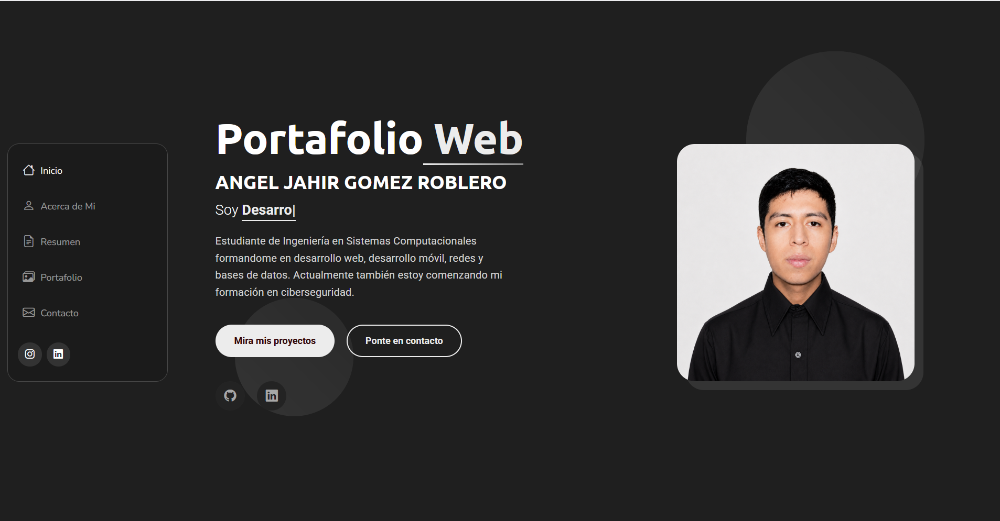
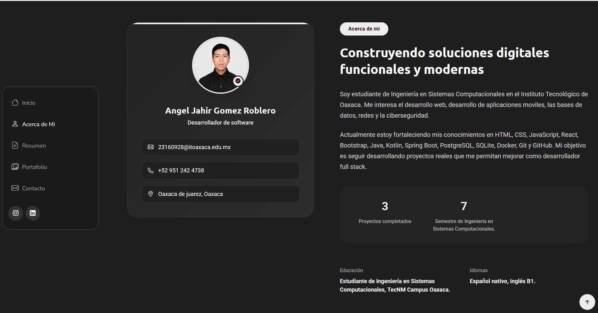
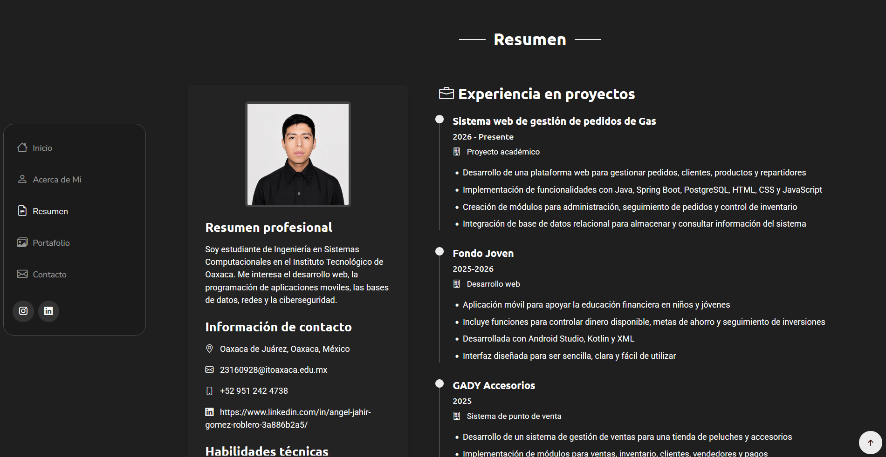
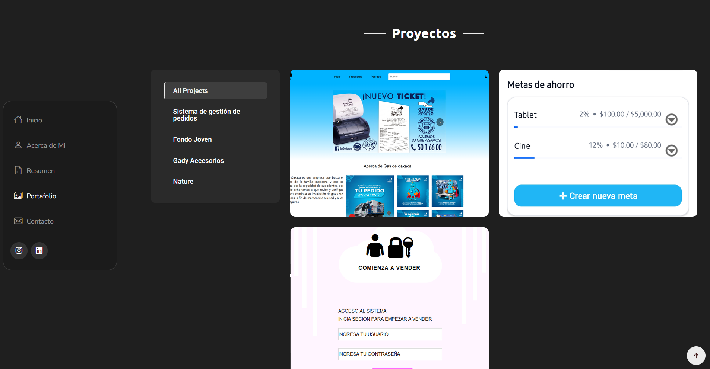
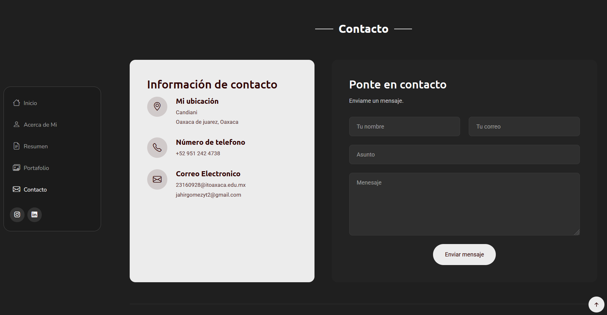

# Portafolio Web Personal

## Portada

**Instituto Tecnológico de Oaxaca**  
**Alumno:** GOMEZ ROBLERO ANGEL JAHIR  
**Docente:** ADELINA MARTINEZ NIETO  
**Materia:** Programación Web  
**Actividad:** Actividad 4. Portafolio Web con Bootstrap   
**Proyecto:** Portafolio Web Personal  


## Descripción breve del proyecto

Este proyecto consiste en el desarrollo de un portafolio web personal utilizando HTML, CSS, JavaScript y Bootstrap. El objetivo principal es presentar información personal, formación académica, habilidades, proyectos realizados y medios de contacto dentro de una página web funcional, organizada y publicada mediante GitHub Pages.

El portafolio fue construido a partir de una plantilla de Bootstrap, la cual fue modificada y personalizada para adaptarla a mi perfil académico y profesional como estudiante de Ingeniería en Sistemas Computacionales.


## Framework CSS utilizado

Para el desarrollo del portafolio se utilizó **Bootstrap 5** como framework principal de estilos.


## Plantilla utilizada

La plantilla utilizada fue:

**SnapFolio - Bootstrap Portfolio Template**

Esta plantilla fue seleccionada porque está diseñada para crear portafolios personales modernos, responsivos y profesionales. Incluye secciones útiles como inicio, acerca de mí, resumen, habilidades, portafolio, detalles de proyectos y contacto.

**Link de la plantilla:**  
https://bootstrapmade.com/snapfolio-bootstrap-portfolio-template/

## Estructura actual del proyecto

La estructura final del proyecto quedó organizada de la siguiente manera:

```txt
SNAPFOLIO/
│
├── css/
│   └── main.css
│
├── img/
│   ├── ApartadoDeProductoas.png
│   ├── gady.png
│   ├── gadyInventario.png
│   ├── gadyPrincipal.png
│   ├── imagenJahir.png
│   ├── loginGas.png
│   ├── PantallaPrincipalFondoJoven.jpg
│   ├── pantallaPrincipalGas.png
│   └── pantallaSecundariaFondoJoven.jpg
│
├── js/
│   └── main.js
│
├── index.html
├── portfolio-details.html
├── portfolio-details2.html
├── portfolio-details3.html
└── Readme.md
```

---

## Estructura original de la plantilla

Al descargar la plantilla original SnapFolio, venía con una estructura más amplia y compleja, compuesta por carpetas y archivos como los siguientes:

```txt
SNAPFOLIO/
│
├── assets/
│   ├── css/
│   ├── img/
│   ├── js/
│   ├── scss/
│   └── vendor/
│
├── forms/
│   └── contact.php
│
├── index.html
├── portfolio-details.html
├── service-details.html
├── starter-page.html
└── Readme.txt
```

Esta estructura original contenía archivos locales para estilos, scripts, imágenes, librerías externas, archivos SCSS y un formulario en PHP.


## Cambios realizados a la estructura original

Para que el portafolio cumpliera con los requisitos de la actividad, hice varios cambios a la estructura original de la plantilla. La idea fue dejar el proyecto más ordenado, más ligero y más fácil de revisar.

Al principio la plantilla venía con muchas carpetas y archivos que no iba a utilizar, por eso decidí simplificarla y quedarme solo con lo necesario para mi portafolio.

Los principales cambios que hice fueron:

1. Dejé de usar la carpeta `assets/vendor` para varias librerías, ya que las cambié por enlaces CDN.
2. Organicé las imágenes del portafolio en una carpeta principal llamada `img`.
3. Conservé el archivo principal de estilos y lo acomodé dentro de la carpeta `css`.
4. Conservé el archivo principal de JavaScript y lo acomodé dentro de la carpeta `js`.
5. Eliminé archivos de ejemplo que venían con la plantilla y que no eran necesarios para mi proyecto.
6. Conservé las páginas de detalles de proyectos para mostrar mejor la información de cada uno.
7. Cambié el contenido original de la plantilla por mi información personal, académica y profesional.
8. Traducí y adapté los textos al español para que el portafolio se entendiera mejor.
9. Reemplacé las imágenes genéricas por capturas reales de mis proyectos y por imágenes propias.
10. Ajusté el proyecto para que funcionara correctamente al publicarlo en GitHub Pages.


## Cambio de archivos locales a CDN

La plantilla original utilizaba varias librerías dentro de la carpeta:

```txt
assets/vendor/
```

Dentro de esa carpeta venían archivos locales de Bootstrap, Bootstrap Icons, AOS, GLightbox, Swiper y otras librerías.

Para evitar tener demasiadas carpetas y archivos innecesarios dentro del proyecto, se reemplazaron varias rutas locales por enlaces mediante CDN.

Antes, la plantilla usaba rutas locales similares a estas:

```html
assets/vendor/bootstrap/css/bootstrap.min.css
assets/vendor/bootstrap/js/bootstrap.bundle.min.js
assets/vendor/bootstrap-icons/bootstrap-icons.css
assets/vendor/aos/aos.css
assets/vendor/glightbox/css/glightbox.min.css
assets/vendor/swiper/swiper-bundle.min.css
```

Después, se utilizaron enlaces CDN como estos:

```html
<link href="https://cdn.jsdelivr.net/npm/bootstrap@5.3.7/dist/css/bootstrap.min.css" rel="stylesheet">
<link href="https://cdn.jsdelivr.net/npm/bootstrap-icons@1.13.1/font/bootstrap-icons.min.css" rel="stylesheet">
<link href="https://cdn.jsdelivr.net/npm/aos@2.3.4/dist/aos.css" rel="stylesheet">
<link href="https://cdn.jsdelivr.net/npm/glightbox/dist/css/glightbox.min.css" rel="stylesheet">
<link href="https://cdn.jsdelivr.net/npm/swiper@11/swiper-bundle.min.css" rel="stylesheet">
```

También se reemplazaron los scripts locales por CDN:

```html
<script src="https://cdn.jsdelivr.net/npm/bootstrap@5.3.7/dist/js/bootstrap.bundle.min.js"></script>
<script src="https://cdn.jsdelivr.net/npm/aos@2.3.4/dist/aos.js"></script>
<script src="https://cdn.jsdelivr.net/npm/typed.js@2.1.0/dist/typed.umd.js"></script>
<script src="https://cdn.jsdelivr.net/npm/@srexi/purecounterjs/dist/purecounter_vanilla.js"></script>
<script src="https://cdn.jsdelivr.net/npm/waypoints/lib/noframework.waypoints.min.js"></script>
<script src="https://cdn.jsdelivr.net/npm/isotope-layout@3/dist/isotope.pkgd.min.js"></script>
<script src="https://cdn.jsdelivr.net/npm/imagesloaded@5/imagesloaded.pkgd.min.js"></script>
<script src="https://cdn.jsdelivr.net/npm/glightbox/dist/js/glightbox.min.js"></script>
<script src="https://cdn.jsdelivr.net/npm/swiper@11/swiper-bundle.min.js"></script>
```

Gracias a este cambio, el proyecto quedó más ligero, más ordenado y más fácil de subir a GitHub Pages.


## Archivos eliminados o no utilizados

Durante la adaptación de la plantilla, algunos archivos originales dejaron de ser necesarios, por ejemplo:

- `forms/contact.php`
- `assets/vendor/`
- `assets/scss/`
- `starter-page.html`
- `service-details.html`

El archivo `contact.php` no se utilizó porque GitHub Pages no ejecuta código PHP. Por esa razón, la sección de contacto se adaptó usando información directa como correo, redes sociales y enlaces profesionales.

## Secciones del portafolio

### Inicio

En esta sección se muestra la presentación principal del portafolio. Incluye el nombre del estudiante, una frase de presentación profesional y una foto de perfil formal.


### Acerca de mí

Esta sección contiene una descripción personal como estudiante de Ingeniería en Sistemas Computacionales, mencionando intereses en desarrollo web, desarrollo móvil, bases de datos y aprendizaje de ciberseguridad.


### Resumen

En esta parte se presenta información relacionada con la formación académica, estudios previos y proyectos desarrollados. Incluye estudios en el Instituto Tecnológico de Oaxaca y formación técnica previa en el CBTis No. 263.

### Habilidades

La sección de habilidades muestra tecnologías y herramientas utilizadas o en proceso de aprendizaje, como HTML, CSS, JavaScript, Bootstrap, Java, PostgreSQL, Git y GitHub.

### Proyectos

En esta sección se muestran proyectos académicos y personales desarrollados durante la formación. Cada proyecto cuenta con una página de detalles donde se explica su objetivo, tecnologías utilizadas y funcionalidades principales.



### Contacto

La sección de contacto permite mostrar medios para comunicarse o conocer más sobre el perfil profesional, incluyendo GitHub, Instagram y LinkedIn.


## Proceso de desarrollo

Para hacer este portafolio primero descargué la plantilla **SnapFolio** de BootstrapMade. Al principio la plantilla venía con una estructura más completa, con carpetas como `assets`, `vendor`, `scss` y `forms`, pero decidí simplificarla para que el proyecto quedara más limpio y fácil de revisar.

Después organicé mejor los archivos del proyecto. Separé mis imágenes en una carpeta `img`, acomodé los archivos principales de estilos y JavaScript, y moví las imágenes que iba a utilizar dentro del portafolio, tanto las personales como las capturas de mis proyectos.

También cambié varias librerías que venían cargadas de forma local y las pasé a enlaces CDN. Con esto evité depender de tantos archivos descargados dentro del proyecto y dejé la estructura más ligera para que funcionara correctamente en GitHub Pages.

Luego empecé a personalizar el archivo `index.html`. Cambié los textos originales de la plantilla, que estaban en inglés, por información mía en español. Agregué mi foto de perfil real, modifiqué la sección de inicio, la parte de “Acerca de mí”, el resumen, mis habilidades y la información de contacto.

En la sección de resumen agregué mi formación actual en Ingeniería en Sistemas Computacionales en el Instituto Tecnológico de Oaxaca, además de mi formación técnica en el CBTis No. 263. También añadí tecnologías que manejo o estoy aprendiendo, como HTML, CSS, JavaScript, Java, Spring Boot, PostgreSQL, Kotlin, Git y GitHub.

Después agregué mis proyectos al portafolio. Entre ellos incluí el sistema web de gestión de pedidos de gas, la aplicación móvil Fondo Joven y otros proyectos personales o académicos. Para mostrar mejor cada proyecto, creé páginas de detalle usando archivos como `portfolio-details.html`, `portfolio-details2.html` y `portfolio-details3.html`.

También ajusté las imágenes de los proyectos para que se vieran bien dentro del diseño, sobre todo las capturas verticales de aplicaciones móviles. Revisé que funcionaran correctamente el menú, los enlaces, las animaciones, los filtros del portafolio y los sliders de imágenes.

Por último, preparé este README para documentar el proceso, subí el proyecto a un repositorio público en GitHub y activé GitHub Pages para publicar el portafolio en línea.


## Modificaciones principales realizadas

## Cambios realizados

Durante la personalización del portafolio fui cambiando la plantilla original para adaptarla a mi información y a mis proyectos. Primero modifiqué el nombre del portafolio, los textos principales y varias secciones que venían en inglés, para dejarlas en español y con contenido propio.

También reemplacé las imágenes genéricas de la plantilla por imágenes mías y capturas reales de mis proyectos. Agregué una foto de perfil formal, cambié las rutas de las imágenes para trabajar con la carpeta `img` y ajusté algunas capturas para que se vieran correctamente dentro del diseño.

Otra parte importante fue adaptar la sección de habilidades, donde coloqué tecnologías que uso o estoy aprendiendo. Además, agregué proyectos académicos y personales, y creé páginas individuales para mostrar más detalles de cada uno.

Para dejar el proyecto más limpio, organicé los archivos en carpetas como `css`, `js` e `img`, eliminé archivos que no necesitaba de la plantilla original y cambié varias librerías locales por enlaces CDN. Esto ayudó a que el portafolio quedara más ligero y funcionara mejor al publicarlo en GitHub Pages.

Por último, personalicé los enlaces sociales, los datos de contacto y revisé que el sitio funcionara correctamente en línea.


## Enlaces


**Repositorio de GitHub:**  
https://github.com/JahirRoblero/MiPortafolio

**Página publicada en GitHub Pages:**  
https://jahirroblero.github.io/MiPortafolio/


## Créditos de la plantilla

Este proyecto fue desarrollado utilizando como base la plantilla **SnapFolio** de BootstrapMade.

**Plantilla:** SnapFolio  
**Autor:** BootstrapMade  
**URL:** https://bootstrapmade.com/snapfolio-bootstrap-portfolio-template/  


